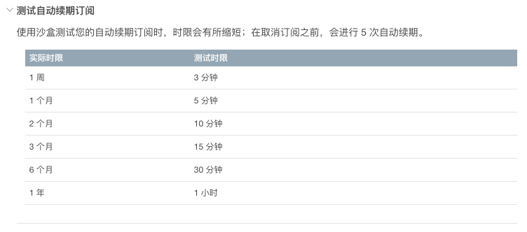

# flutter_iap_ios
专门针对iOS内购的插件,测试前需要有开发者账号，并且账号需要设置相关银行收款信息为有效状态，内购商品等都配置成待提交状态。方可拉取成功商品信息，完成内购购买。


# 使用方法

## 注意：

- 消耗类、非消耗类商品和永久性商品：用户的购买成功后状态和业务逻辑需要应用层自己去控制。


## 步骤：

- 初始化商品信息,并验证订阅类型商品是否有效期内***（需初始化完商品信息后在验证）***

``` dart
  //初始化商品信息
  Future<void> initProducts() async {

    var list = ['viptest','VipMonth'];

    List iosResultsList;

    iosResultsList =  await FlutterIapIos.initProducts(list: list);
    //iOS这边会返回给Flutter一个字典数组，如下数据结构
    //productId：商品ID title：商品标题 desc：商品描述 
    //priceLocale：带本地化的价格 price：只有价格
    //numberOfTrialUnitsStr：0代表订阅商品无设置试用 反之为试用时长如【3、7】
    //trialUnitStr：如果设置了试用，时长单位字符串如：【天、周、月、年】
    /*(
        {
            desc = "1";
            numberOfTrialUnitsStr = 0;
            price = "3.99";
            priceLocale = "\U00a53.99";
            productId = VipMonth;
            title = "1\U4e2a\U6708\U4f1a\U5458";
            trialUnitStr = "\U5929";
        },
        {
            desc = "aaaa";
            numberOfTrialUnitsStr = 0;
            price = 6;
            priceLocale = "\U00a56.00";
            productId = viptest;
            title = aaa;
            trialUnitStr = "\U5929";
        }
    )*/
    if(iosResultsList.length>0){
      setState(() {
        print("========initProducts=======setState");
        //商品列表初始化完成后在验证是否有购买订阅类产品，是否在有效期内
        checkHasSubscribe();
      });
    }

  }
  
  //验证订阅类型商品是否有效期内
  Future<void> checkHasSubscribe() async {
    bool ret = await FlutterIapIos.hasSubscribe();
    if(ret){
      setState(() {
        //有效
      });
    }else{
      setState(() {
        //无效
      });
    }
  }
```

- 购买某个内购商品

``` dart
  Future<void>  _buyProductId(String productId) async {
    print(productId);
    bool ret =  await FlutterIapIos.payProductId(productId: productId);
    if(ret){
      setState(() {
        //订阅购买成功！
      });
    }else{
      setState(() {
        //订阅购买失败！
      });
    }
  }
```

- 恢复购买

``` dart
  Future<void> _restore() async {
    bool ret =  await FlutterIapIos.initRestore();
    if(ret){
      setState(() {
        //恢复订阅购买成功！
      });
    }else{
      setState(() {
        //恢复订阅购买失败！
      });
    }
  }
```


# 测试流程注意
- 沙盒测试的时候，注意自动续费订阅的时效性

